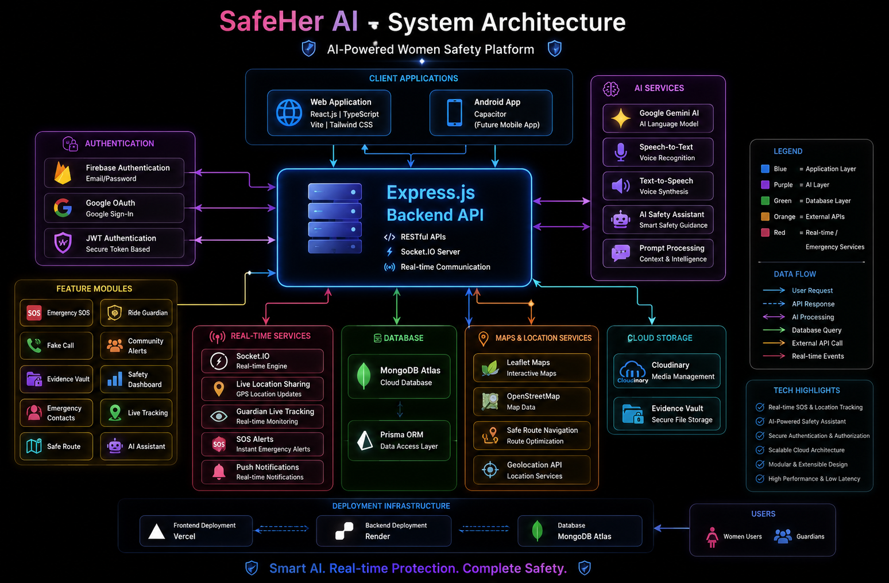
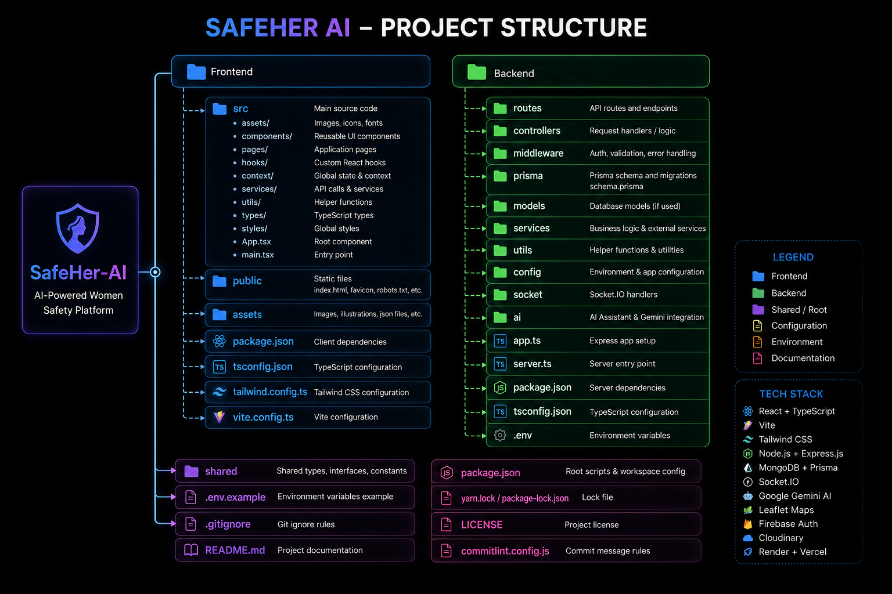
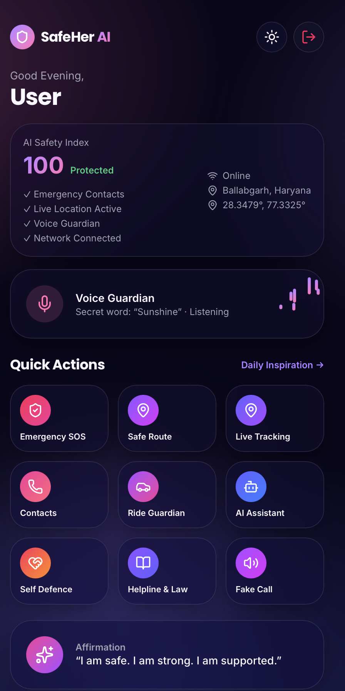
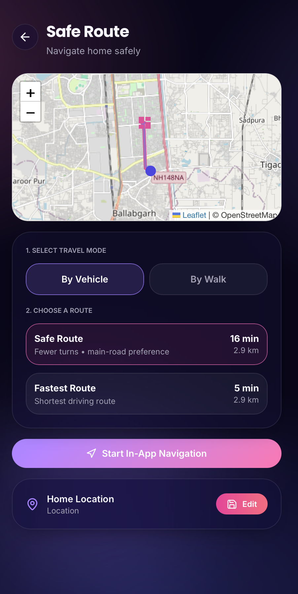

<h1 align="center">SafeHer AI</h1>
<h3 align="center">
SafeHer AI is an AI-powered women safety platform that combines Artificial Intelligence, real-time communication, and location intelligence to provide proactive protection during emergencies. It empowers users with intelligent safety features including AI voice assistance, emergency SOS, live guardian tracking, safe route navigation, fake calls, and secure evidence collection.
</h3>
<h2>Live Demo</h2>

[https://safe-herai.vercel.app](https://safeher360.vercel.app)
<p>The backend is deployed on Render, which automatically goes to sleep after a period of inactivity. On the first visit, it may take <b>1-2 minutes</b> for the backend to wake up. Please wait briefly before using the application.</p>


<h2>Features</h2>
<h3>User Safety Features</h3>

- AI Safety Assistant
- Live Location Sharing
- Emergency SOS
- Fake Call Simulation
- Ride Guardian
- Safe Route Navigation
- Emergency Contacts
- Guardian Connection
- Safety Dashboard
- Evidence Vault
- Community Safety Alerts
- Nearby Safe Places
- Real-time Notifications
- Secure Authentication
- Responsive Glassmorphism UI
<h3>Guardian Features</h3>

- Guardian Login
- Live User Tracking
- Real-time Map Monitoring
- Instant SOS Alerts
- Multiple Connected Users
- Emergency Navigation
- User Activity Status
- Emergency Notification System
<h3>AI Features</h3>

- AI Safety Assistant
- Natural Language Conversations
- Speech-to-Text
- Text-to-Speech
- Emergency Guidance
- Hands-free Voice Interaction
- AI Safety Recommendations
- Intelligent Risk Assistance
<h3>Safety & Navigation</h3>

- Safe Route Navigation
- Live GPS Tracking
- Route Risk Awareness
- Location Sharing
- Emergency Route Assistance
- Ride Monitoring
- Interactive Maps
<h2>Technology Stack</h2>
<h3>Frontend</h3>

- React.js
- TypeScript
- Vite
- TanStack Router
- Tailwind CSS
- Framer Motion
- React Query
- React Hook Form
- Leaflet Maps
- Axios
<h3>Backend</h3>

- Node.js
- Express.js
- MongoDB
- Prisma ORM
- Socket.IO
- JWT Authentication
- Google OAuth
- Firebase Authentication
- REST APIs
<h3>Artificial Intelligence</h3>

- Google Gemini AI
- Large Language Models (LLMs)
- Speech Recognition
- Text-to-Speech
- AI Safety Assistance
- Prompt Engineering
<h3>Database & Cloud</h3>

- MongoDB Atlas
- Cloudinary
- Render
- Vercel


<h2>Installation</h2>
<h3>Clone Repository</h3>

```bash
git clone https://github.com/tusharbanga/SafeHer-AI
cd SafeHer-AI
```
<h3>Install Dependencies</h3>
<p>Backend</p>

```bash
cd Backend
npm install
```
<p>Frontend</p>

```bash
cd ../Frontend
npm install
```
<h2>Environment Variables</h2>
<h3>Frontend (.env)</h3>

```env
VITE_API_URL=http://localhost:5000/api
VITE_GEOAPIFY_API_KEY=YOUR_GEOAPIFY_API_KEY
```
<h3>Backend (.env)</h3>

```env
NODE_ENV=development
PORT=5000
CLIENT_URL=http://localhost:8080
API_BASE_URL=http://localhost:5000

MONGODB_URI=YOUR_MONGODB_URI

BCRYPT_SALT_ROUNDS=12

FIREBASE_PROJECT_ID=YOUR_FIREBASE_PROJECT_ID
FIREBASE_Backend_EMAIL=YOUR_FIREBASE_CLIENT_EMAIL
FIREBASE_PRIVATE_KEY="YOUR_FIREBASE_PRIVATE_KEY"

GROQ_API_KEY=YOUR_GROQ_API_KEY
GROQ_MODEL=llama-3.3-70b-versatile
GROQ_API_URL=https://api.groq.com/openai/v1/chat/completions

RATE_LIMIT_WINDOW_MS=900000
RATE_LIMIT_MAX=200
SOS_RATE_LIMIT_MAX=100

SOCKET_CORS_ORIGIN=http://localhost:8080
```
<h2>Running the Project</h2>
<h3>Backend</h3>

```bash
cd backend
npm run dev
```
<h3>Frontend</h3>

```bash
cd frontend
npm run dev
```
<h2>Application URLs</h2>
<p><b>Frontend</b></p>

```
http://localhost:8080
```

<p><b>Backend</b></p>

```
http://localhost:5000
```
<h2>Screenshots</h2>

<p align="center">
  
  
</p>
<h2>Deployment</h2>
<p>Frontend - Vercel</p>
<p>Backend - Render</p>
<p>Database - MongoDB Atlas</p>
<h2>Security Features</h2>

- Google OAuth
- Firebase Authentication
- Protected Routes
- Secure API Communication
- Password Encryption
- Role-Based Guardian Access
<h2>Roadmap</h2>

- AI Risk Prediction
- Background Threat Detection
- Voice Trigger SOS
- Emergency Video Recording
- Smart Wearable Integration
- Offline Emergency Mode
- Crash Detection
- AI Incident Analysis
- Nearby Safe Zone Detection
- Multi-language AI Assistant
- Emergency Call Automation
- Anonymous Community Reporting
<h2>License</h2>
This project is developed for educational, research, and social impact purposes.
